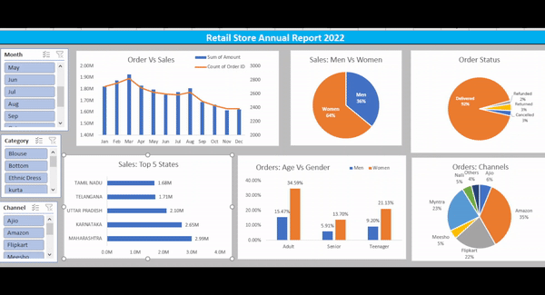
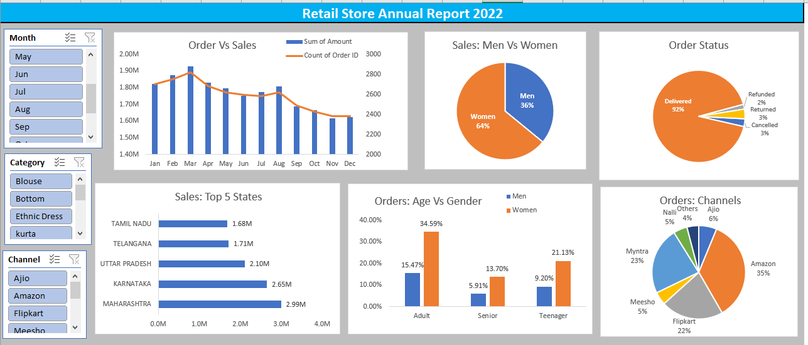

# Retail Store Data Analysis

## Project Demo:

## Objective:
Retail store wants to create an annual sales report for 2022. so that, Retail can understand their customers and grow more sales in 2023.

## Sample questions:
- compare the sales and orders usin single chart
- which month got the highest sales and orders?
- who purchased more - men or women in 2022?
- what are different order status in 2022?
- list top 10 states contributing to the sales?
- relation between age and gender based on number of orders
- which channel is contributing to maximum sales?
- highest selling category?

## Tools:

- Microsoft Excel
- Pivot Table
- Pivot Charts

## ETL (Extract, Transform, and Load) Process:

- Dataset is downloaded from online source as .xlsx file and open with Excel.
- Handling missing value and properly format the data
- Transform the dataset into pivot tables and preprocess on it as per requirements.
- Loaded the pivot tables and applied different pivot charts which suitable for gaining accurate outcomes to analyze efficiently.

## Insights & Findings:
- women are more likely to buy compared to men(~65%)
- Maharashtra, karnataka and Uttar Pradesh are the top 3 states(~35%)
- Adult age group (30-49 yrs) is max contributing (~50%)
- Amazon, flipkart and Myntra are max contributing (~80%)

## Final conclusion to improve Retail Store sales:
- Target women customers of age group (30-49 yrs) living in Maharashtra, Karnataka and Uttar Pradesh by showing ads/offerts/coupons available on Amazon, Flipkart and Myntra.

## Dashboard Preview:

## Data Source:

Store Data is available in the (.xlsx) file named "***Retail Store Data***". [Click Here](Retail_Store_Data.xlsx) to see the dataset.